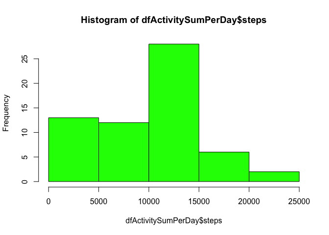
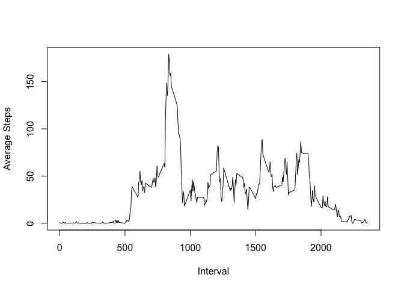
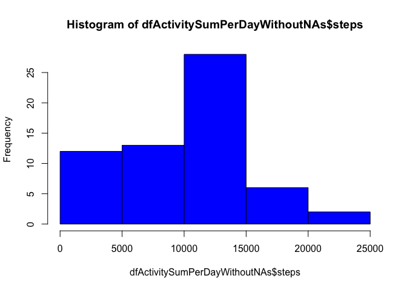
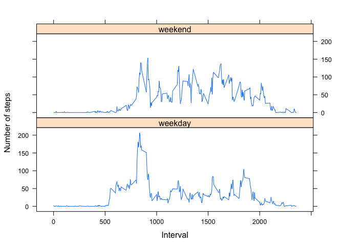

# Reproducible Research: Peer Assessment 1


## Loading and preprocessing the data

```r
setwd("~/")
dfActivity <- read.csv("./RepData_PeerAssessment1/activity.csv")
head(dfActivity)
```

```
##   steps       date interval
## 1    NA 2012-10-01        0
## 2    NA 2012-10-01        5
## 3    NA 2012-10-01       10
## 4    NA 2012-10-01       15
## 5    NA 2012-10-01       20
## 6    NA 2012-10-01       25
```


## What is mean total number of steps taken per day?
### 1. Calculate the total number of steps per day 

```r
library(dplyr)
```

```
## 
## Attaching package: 'dplyr'
```

```
## The following objects are masked from 'package:stats':
## 
##     filter, lag
```

```
## The following objects are masked from 'package:base':
## 
##     intersect, setdiff, setequal, union
```

```r
dfActivitySumPerDay <- dfActivity %>% 
  select(date, steps) %>%
  group_by(date) %>%
  summarize(steps=sum(steps, na.rm=TRUE)) %>% 
  arrange (date)
```
### 2. Make histogram

```r
hist(dfActivitySumPerDay$steps, col="green")
```



### 3. Calculate and report the mean and median of the total number of steps taken per day

```r
mean(dfActivitySumPerDay$steps, na.rm=TRUE)
```

```
## [1] 9354.23
```

```r
median(dfActivitySumPerDay$steps, na.rm=TRUE)
```

```
## [1] 10395
```

## What is the average daily activity pattern?
### 1. Make a time series plot (i.e. 𝚝𝚢𝚙𝚎 = "𝚕") of the 5-minute interval (x-axis) and the average number of steps taken, averaged across  all ### days (y-axis)

```r
dfActivitySumInterval5 <- dfActivity %>% 
  select(interval, date, steps) %>%
  group_by(interval,date) %>%
  summarize(steps=sum(steps, na.rm=TRUE)) %>% 
  arrange (interval)

dfActivityAverageInterval5 <- dfActivitySumInterval5 %>% 
  select(interval, steps) %>%
  group_by(interval) %>%
  summarize(steps=mean(steps, na.rm=TRUE)) %>% 
  arrange (interval)

plot(dfActivityAverageInterval5$interval,dfActivityAverageInterval5$steps,type="l", xlab="Interval", ylab="Average Steps")
```



### 2. Which 5-minute interval, on average across all the days in the dataset, contains the maximum number of steps?. 

```r
dfActivityIntervalWithMaxSteps <- subset(dfActivityAverageInterval5, steps == max(steps))
dfActivityIntervalWithMaxSteps$interval
```

```
## [1] 835
```

## Imputing missing values
### 1. Calculate and report the total number of missing values in the dataset (i.e. the total number of rows with 𝙽𝙰s)

```r
sum(is.na(dfActivity))
```

```
## [1] 2304
```

### 2. Devise a strategy for filling in all of the missing values in the dataset. The strategy does not need to be sophisticated. 
###    For example, you could use the mean/median for that day, or the mean for that 5-minute interval, etc.
### 
### Strategy for filling missing values: use the mean value for interval using the dataframe dfActivityAverageInterval5

```r
head(dfActivityAverageInterval5)
```

```
## Source: local data frame [6 x 2]
## 
##   interval      steps
##      (int)      (dbl)
## 1        0 1.49180328
## 2        5 0.29508197
## 3       10 0.11475410
## 4       15 0.13114754
## 5       20 0.06557377
## 6       25 1.81967213
```

### 3. Create a new dataset that is equal to the original dataset but with the missing data filled in.

```r
dfActivityWithoutNAs <- dfActivity

# replacing the NA values with the average for the interval
dfActivityWithoutNAs$steps[is.na(dfActivityWithoutNAs$steps)] <- dfActivityAverageInterval5$steps[dfActivityAverageInterval5$interval==dfActivityWithoutNAs$interval]
```

```
## Warning in dfActivityWithoutNAs$steps[is.na(dfActivityWithoutNAs$steps)] <-
## dfActivityAverageInterval5$steps[dfActivityAverageInterval5$interval == :
## number of items to replace is not a multiple of replacement length
```
### 4. Make a histogram of the total number of steps taken each day and Calculate and report the mean and median total number of steps taken per day. 

```r
dfActivitySumPerDayWithoutNAs <- dfActivityWithoutNAs %>% 
  select(date, steps) %>%
  group_by(date) %>%
  summarize(steps=sum(steps, na.rm=TRUE)) %>% 
  arrange (date)

hist(dfActivitySumPerDayWithoutNAs$steps, col="blue")
```



```r
mean(dfActivitySumPerDayWithoutNAs$steps, na.rm=TRUE)
```

```
## [1] 9507.578
```

```r
median(dfActivitySumPerDayWithoutNAs$steps, na.rm=TRUE)
```

```
## [1] 10395
```
###    Do these values differ from the estimates from the first part of the assignment? 
###
### - The mean values goes from 9354.23 to 9507.578
### - The median value stays the same 10395
### 
###    What is the impact of imputing missing data on the estimates of the total daily number of steps?
### - The impact of imputing missing values is low.

## Are there differences in activity patterns between weekdays and weekends?
### 1. Create a new factor variable in the dataset with two levels -- "weekday" and "weekend" indicating whether a given date is a ###   weekday or weekend day.

```r
dfActivityWithoutNAs <- cbind(dfActivityWithoutNAs, Day=weekdays(as.Date(dfActivityWithoutNAs$date)))
dfActivityWithoutNAs <- cbind(dfActivityWithoutNAs, Daytype=ifelse(dfActivityWithoutNAs$Day == "Saturday" | dfActivityWithoutNAs$Day == "Sunday","weekend","weekday"))
```
### 2. Make a panel plot containing a time series plot (i.e. 𝚝𝚢𝚙𝚎 = "𝚕") of the 5-minute interval (x-axis) and the average ###  number of steps taken, averaged across all weekday days or weekend days (y-axis)

```r
dfActivityWithoutNAsSumInterval5 <- dfActivityWithoutNAs %>% 
  select(Daytype, interval, date, steps) %>%
  group_by(Daytype,interval,date) %>%
  summarize(steps=sum(steps, na.rm=TRUE)) %>% 
  arrange (Daytype,interval, date)

dfActivityWithoutNAsAverageInterval5 <- dfActivityWithoutNAsSumInterval5 %>% 
  select(Daytype,interval, steps) %>%
  group_by(Daytype,interval) %>%
  summarize(steps=mean(steps, na.rm=TRUE)) %>% 
  arrange (Daytype,interval)
library(lattice)
xyplot( steps ~ interval | Daytype, data=dfActivityWithoutNAsAverageInterval5, layout=c(1,2), xlab="Interval", ylab="Number of steps",type = "l")
```


